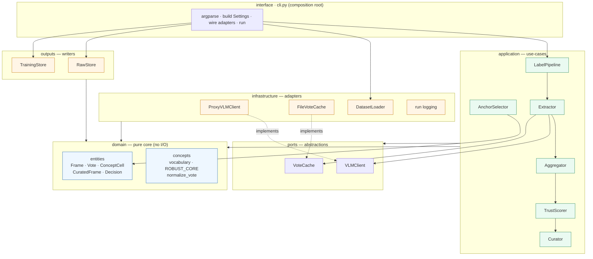
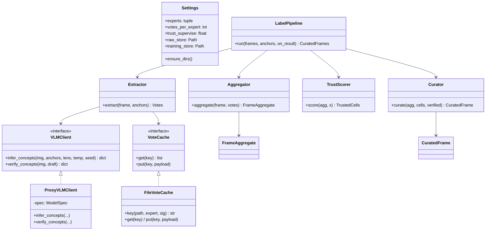
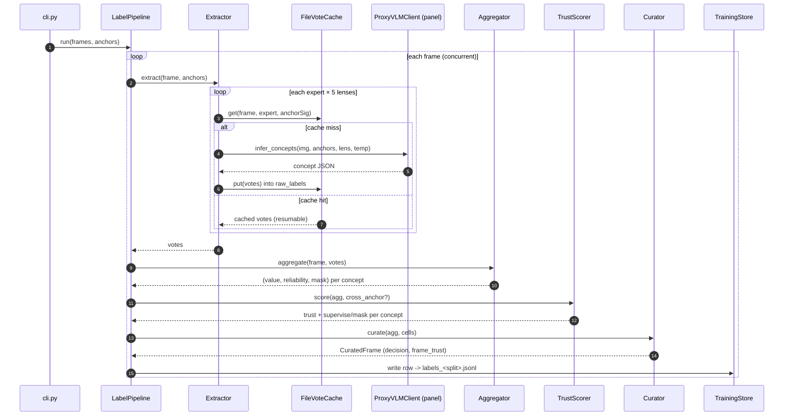
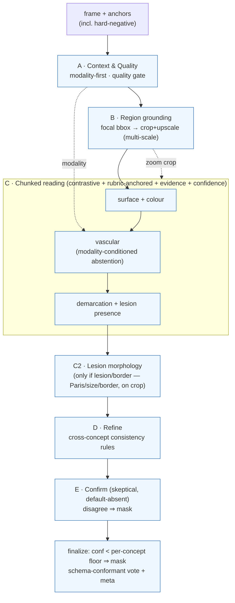
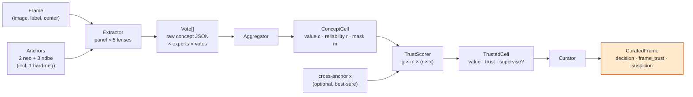
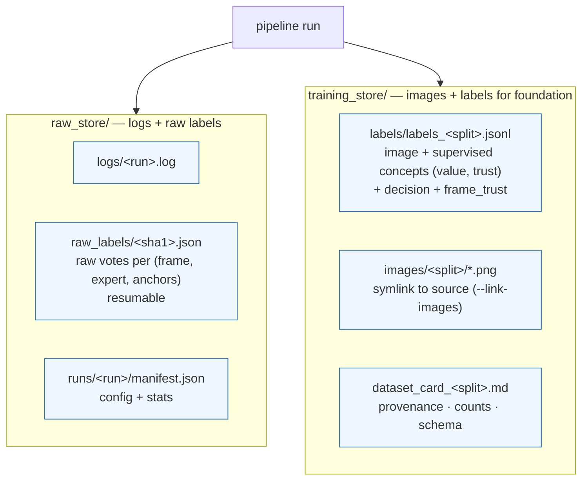
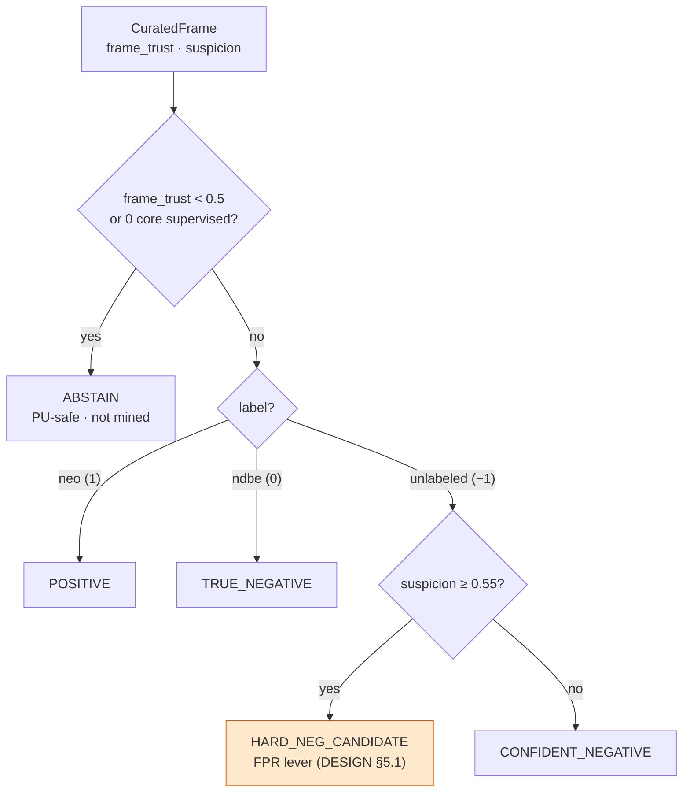

# agent_system — Architecture

Clean / hexagonal architecture for generating reliability-weighted clinical-concept labels for the
RACE foundation model. Dependencies point **inward**: `application` and `domain` know nothing about
the VLM gateway, the filesystem, or the CLI — those are adapters behind `ports`.

---

## 1. Layered overview (dependency rule)

> **Why:** the only code that talks to a model is `ProxyVLMClient`; the only code that touches disk
> for votes is `FileVoteCache`. Swapping the gateway or the cache is one new adapter — use-cases and
> domain stay untouched and unit-testable.

---

## 2. Module / class map

---

## 3. Per-frame request flow (sequence)

---

## 3b. Multi-stage extraction agent (the reading of one frame × expert)

`Extractor` delegates one (frame, expert) reading to an `ExtractionStrategy`. The default
`MultiStageStrategy` (v3) decomposes the weak "all-35-concepts-in-one-prompt" call into focused,
skill-hardened prompts. Confident, cross-checked values survive; low-confidence or unconfirmed
ones become `not_assessable` (a mask) so reliability/trust down-weights them.

**Hard-class skills (v3):** ordinal **rubric anchoring** (each 0–4 level defined), **contrastive**
rating vs the NDBE reference, **modality-conditioned** vascular assessment with calibrated
abstention, **multi-scale crop** of the focal region for resolution-limited features, a
**conditional morphology** sub-stage (Paris/size/border only when a lesion/border exists), and
**per-concept confidence floors** (vascular lower so it isn't over-masked).

Strategy is swappable (`--strategy single|multistage`); cache is namespaced by strategy so the two
never collide. Per-stage outputs, confidences, region, and masked concepts are stored in the raw
label `meta` for full traceability.

## 4. Data transformation

---

## 5. Output stores (artifacts)

---

## 6. Frame decision policy

