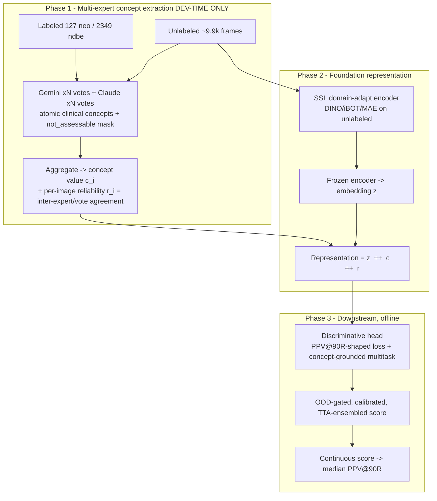

# VLM-Concept Foundation for Rare Neoplasia Detection
### RARE26 · A reliability-weighted clinical-concept representation, learned from labeled + unlabeled data, optimized directly for PPV@90Recall

**Document type:** Research design (supersedes the "VLM-as-label-producer" framing in `01`/`03`)
**Companions:** `02_FEASIBILITY_RESULTS.md` (the experiment that motivates the pivot), `RARE26_CHALLENGE_NOTES.md`
**Working name:** **RACE** — *Reliability-Aware Concept Ensemble*

---

## 0. The pivot in one paragraph

The feasibility study proved the VLM's **holistic `p_neo` judgment** is the weak link (FPR@90R 12–37%, need ≤0.5%) — not because it cannot *see* neoplastic features, but because it cannot *integrate* them into a calibrated probability at 1% prevalence (it ranks a 0.913 negative above a 0.849 positive). RACE keeps the VLM only for what it is demonstrably good at — **atomic visual perception** — and moves the integration to a discriminative model that we can shape directly toward the false-positive tail. The VLM, across **multiple experts (Gemini + Claude)** and votes, extracts a **reliability-weighted clinical-concept vector** for *every* labeled and unlabeled frame. Those concepts + a **domain-adapted foundation encoder** form the representation; a lightweight head trained under a **prevalence-shaped objective** does the integration. The unlabeled corpus is mined for the thousands of **hard NDBE look-alikes** that cause the confident false positives the metric punishes.

---

## 1. Three phases (your framing, made concrete)



- **Phase 1 — extract:** every frame (labeled + unlabeled) gets a concept vector from ≥2 VLM families × N votes. This is **development-time only** — no VLM ships in the `--network=none` container.
- **Phase 2 — represent:** SSL-adapt a public foundation encoder on the unlabeled corpus; the representation is `[embedding z] ⊕ [concept vector c] ⊕ [reliability vector r]`.
- **Phase 3 — predict:** a small head integrates the representation under a tail-focused objective, with OOD gating + calibration + TTA for a stable median.

---

## 2. The concept vocabulary (Phase 1 deliverable)

Design rules so the labels are *easy and confident*:
1. **Atomic & perceptual** — about color, geometry, texture, presence/absence; never "is this neoplasia."
2. **Clinically grounded** — derived from **BING** (Barrett's Int'l NBI Group: mucosal & vascular regularity), **Paris** (superficial-lesion morphology), and **ARGOS/Amsterdam** endoscopic dysplasia criteria.
3. **Explicit `not_assessable`** on every item → uncertainty becomes a *mask channel*, not noise.
4. **Ordinal 0–4 Likert** for the discriminative items (kills the 0/1 snapping flagged in `02` §3.4) — averaged across experts/votes → a *soft* concept value in [0,1].
5. **Two gates to enter the "core" set:** high inter-expert agreement (κ) **AND** non-trivial mutual information with the label. Reliable-but-useless (e.g. modality) stays as *context/gating*, not as a discriminative concept.

Tiers ordered by role. "Reliab." = expected VLM agreement; "Discrim." = expected signal for neoplasia.

### Tier S — Acquisition context  (Reliab. ★★★★★ · Discrim. ★ · role: gating/normalization)
| Concept | Values |
|---|---|
| modality | white_light / virtual_chromo(NBI·BLI·LCI) / dye_chromo / unclear |
| magnification (near-focus) | yes / no |
| distance | close / medium / far |
| view | en_face / tangential / luminal_overview |
| landmark visible | GEJ_Zline / gastric_folds / squamous_island / tubular_only / none |
| interpretable mucosa fraction | low / medium / high |

> *Why context matters:* NBI vs white-light flips the entire color/vessel distribution. The student must **condition** concept interpretation on modality — an "irregular vascular pattern" means different things under NBI vs WLI. These are near-perfectly labelable.

### Tier A — Quality / artifact  (Reliab. ★★★★★ · Discrim. ★ · role: OOD + FPR protection)
| Concept | Values |
|---|---|
| blur / motion | none / mild / severe |
| specular glare | none / some / heavy |
| exposure | ok / over / under |
| mucus·bubbles·foam | yes / no |
| debris / food residue | yes / no |
| blood / bleeding | yes / no |
| **black border / mask present** | yes / no  *(center cue — must NOT drive suspicion)* |
| **overlay text/graphics/markers** | yes / no  *(center cue — see `03` §4)* |

> The black-box redactions (center_1) and left-edge overlays (center_2) are **center identifiers, not pathology**. Capturing them explicitly lets the model *de-bias* them rather than learn "center_2 ⇒ suspicious."

### Tier B — Color / chromatic  (Reliab. ★★★★ · Discrim. ★★★)
| Concept | Values |
|---|---|
| dominant mucosal color | salmon_pink / red / pale / nbi_brown_cyan (modality-aware) |
| **focal erythema** (reddish area distinct from surround) | 0–4 |
| color heterogeneity across segment | uniform / patchy |
| whitish / opaque focal area | yes / no |
| color-change locality | focal / diffuse / none |

### Tier C — Surface / mucosal pattern  (Reliab. ★★★ · Discrim. ★★★★ · BING-mucosal)
| Concept | Values |
|---|---|
| mucosal pattern type | flat / villous_ridged / circular_pit / irregular_distorted / featureless_absent |
| **pattern regularity** | 0–4 (0 regular-uniform → 4 markedly irregular) ← *key BING axis* |
| nodularity / raised area | yes / no |
| depression / excavation / ulceration | yes / no |
| surface effacement (pattern lost) | yes / no |

### Tier D — Vascular  (Reliab. ★★★ when assessable · Discrim. ★★★★ · BING-vascular)
| Concept | Values |
|---|---|
| vessels assessable | yes / no  *(mask gate)* |
| **vascular pattern regularity** | 0–4 ← *key BING axis* |
| dilated / caliber-variable vessels | yes / no |
| focal abnormal vessels distinct from surround | yes / no |

### Tier E — Demarcation / focality  (Reliab. ★★★ · Discrim. ★★★★★ — the single strongest concept)
| Concept | Values |
|---|---|
| **sharply demarcated focal area present** | 0–4 ← *THE feature* |
| border sharpness | sharp / gradual / n.a. |
| **co-localization** (surface AND vascular abnormality in the same demarcated spot) | yes / no — *highly specific combined cue* |

### Tier F — Lesion morphology / Paris  (Reliab. ★★★★ on shape · Discrim. ★★★★ when present)
| Concept | Values |
|---|---|
| discrete lesion present | yes / no |
| Paris type | 0-Is/Ip polypoid / 0-IIa elevated / 0-IIb flat / 0-IIc depressed / 0-III excavated / n.a. |
| lesion size rel. frame | small / medium / large / n.a. |

### Tier G — Weak gestalt (kept as ONE feature, never the decision)
| Concept | Values |
|---|---|
| overall suspicion (the old `p_neo`) | 0–4 — *one input among many; the feasibility shows it must not be trusted alone* |

**~30 atomic concepts.** After the reliability×discriminativeness filter on a labeled calibration slice, expect ~12–18 to survive into the *core* discriminative set; the rest ride along as context/quality/mask channels.

---

## 3. Phase 1 — multi-expert extraction protocol

```
for each frame f (labeled ∪ unlabeled):
    for expert E in {gemini, claude}:           # ≥2 independent VLM families
        for vote v in 1..N:                      # diverse lens + temperature (reuse LENSES from vlm_extract.py)
            j[E,v] = E(f, concept_schema, anchors)   # JSON, cached to disk (resumable)
    for each concept i:
        c_i  = aggregate(values)                 # ordinal -> mean -> [0,1]; categorical -> soft vote share
        r_i  = agreement(values)                 # 1 - normalized dispersion across experts×votes
        m_i  = frac(not_assessable)              # mask channel
```

- **Reusing your infra:** this is a superset of `agent/vlm_extract.py` — same caching, anchors, `LENSES`, retry/parse logic. Swap the single rich schema for the concept schema; add a second `make_llm` backend for Claude.
- **`r_i` (per-image, per-concept reliability) is the novel signal.** Where Gemini and Claude (and votes) agree, the concept is trustworthy *for that image*; where they diverge, the student learns to discount it. This is uncertainty that is **measured, not assumed**.
- **Reliability filter (do this once, report it):** on the labeled set, compute (a) Krippendorff/Cohen κ per concept across experts, (b) MI(concept, label). Promote to *core* only if κ ≥ ~0.6 **and** MI > 0. This table is a clean methods contribution and answers "which clinical features can a VLM label reliably?"

---

## 4. Phase 2 — the foundation representation

**Encoder (do NOT train from scratch — 127 positives forbids it):**
1. Start from a public, licensed foundation encoder — DINOv2 as the safe baseline; a GI/endoscopy SSL backbone if a licensed one is available (disclose per rules).
2. **Domain-adapt** with self-supervised continued pretraining (DINO/iBOT or MAE) on the **~9.9k unlabeled** frames (+ any allowed public BE/endoscopy data). This is the headline use of the unlabeled corpus and improves both the embedding `z` and the OOD geometry. Encoder then **frozen**.

**Representation per frame:** `x = [ z  ‖  c  ‖  r  ‖  context/quality ]`
- `z` — embedding (captures texture the concepts miss),
- `c` — soft concept values (clinical prior, interpretable),
- `r` — per-concept reliability (how much to trust each concept *here*),
- context/quality — modality, mask flags, blur (for conditioning & de-biasing).

> **Why fuse, not replace:** concepts inject the clinical directions the generic encoder lacks (helps the *subtle-positive recall ceiling* in `02` §4.2); the embedding covers what 30 concepts cannot. Ablation (concepts-only / z-only / fused) is a required result.

---

## 5. Phase 3 — downstream, built for PPV@90Recall

The metric is decided in the **negative tail**: at 90% recall the threshold sits at the ~10th-percentile positive; only the handful of negatives ranked above it cost you. So the head is shaped for that tail, not for average accuracy.

1. **Hard-negative mining at scale (biggest FPR lever).** Run concept extraction on all ~9.9k unlabeled frames. Those with **neoplasia-like concept profiles** (high demarcation + irregular surface/vessels) yet (at 1% prevalence) almost certainly negative are the *exact* look-alikes that produced the confident-FP tail. Mine them as hard negatives → the most direct attack on FPR. (Treat as PU / uncertain-negative: do not assume *all* unlabeled are negative; abstain on the OOD-gated extremes.)
2. **Prevalence-shaped / tail-focused objective.** Replace plain BCE with a loss that explicitly penalizes *any negative ranked above the low-percentile positives* (a smoothed PPV@90R surrogate / ranked-list loss / sorted-FP penalty). Most teams will use BCE+focal and pick the threshold post-hoc — directly shaping the tail is the differentiator.
3. **Concept-grounded multitask head (interpretability + regularization).** The head predicts the label **and** reconstructs the core concepts as auxiliary outputs. With only 127 positives this regularizes the representation toward clinical directions, fights overfitting, and yields a **per-image explanation** ("flagged: demarcation 0.8, irregular vessels 0.7") — strong for the paper and for the offline model (concepts predicted, no VLM needed at test time).
4. **Negative-manifold density score.** With ~12k negatives, model the negative manifold in `[z‖c]` space (Mahalanobis/kNN, per center). Fuse a one-class anomaly score with the discriminative score — natural for 1% prevalence and FPR-protective.
5. **Cross-center OOD gating + stability.** Per-center OOD stats; shrink (never veto) atypical/low-quality frames toward negative. Ensemble + TTA to minimize variance — the score is a **median over 1000 resamples**, so a stable, well-separated margin beats a lucky single model.
6. **Select on the real number.** Tune checkpoints/threshold on your local 1000× 1%-prevalence bootstrap of `median PPV@90R` (`scripts/eval_ppv.py`), with **leave-one-center-out** as the honest generalization check.

**Offline-legal:** the container ships encoder + concept-predicting head + OOD stats only. The VLMs are development-time annotators; their knowledge survives as the concept supervision baked into the head.

---

## 6. Novelty, ranked by expected PPV@90R impact

1. **Concept-guided hard-negative mining from the unlabeled corpus** — directly shrinks the confident-FP tail that dominates the metric. *Highest leverage.*
2. **Prevalence-shaped tail objective** — optimize the number that ranks you, not a proxy.
3. **SSL domain-adapted encoder + concept-grounded multitask head** — attacks the subtle-positive *recall ceiling* (`02` §4.2) that pure prompting could not.
4. **Reliability-weighted VLM concept bottleneck** (`c ⊕ r`, multi-expert, per-image) — the interpretable, paper-defining contribution: *measured* concept uncertainty, not assumed.
5. **Negative-manifold density fusion** — one-class scoring suited to 1% prevalence.
6. **Cross-center OOD gating + TTA/ensemble** — protects the operating point and the median under test-set shift.

**Headline claim for the paper:** *"A reliability-filtered, VLM-extracted clinical-concept vocabulary — fused with a domain-adapted foundation encoder and trained under a prevalence-shaped objective — turns an LLM that cannot itself exceed 0.08 PPV@90R into the supervision for a model that does, while remaining fully interpretable and offline-deployable."*

---

## 7. Honest risks

| Risk | Mitigation |
|---|---|
| Concepts too noisy to help | Reliability filter (§3) keeps only κ≥0.6 ∧ MI>0; `r` lets the head down-weight per image; fall back to z-only if ablation says so |
| Concepts add nothing over `z` | Required ablation (z-only / c-only / fused); report honestly — fusion must *earn* its place |
| Unlabeled ≠ all negative (the rare ~1%) | PU treatment + OOD-gated abstention on extremes; never hard-label the uncertain middle |
| Concept extraction cost over ~12k frames × 2 experts × N votes | Cache aggressively (already built); cap votes at the cost/quality knee; experts run once, reused across all downstream sweeps |
| The recall ceiling persists (subtle positives unseen) | Multitask concept grounding + SSL adaptation; magnify/near-focus subset analysis; accept ceiling and report it |
| Cross-center shift at test | Per-center OOD, LOCO validation, de-bias center-cue concepts (Tier A) |

---

## 8. Immediate next steps

1. **Freeze the concept schema** (§2) as `agent/concept_schema.py` (superset of current `schema.py`).
2. **Add a Claude backend** to `agent/llm.py`; extend `vlm_extract.py` → `concept_extract.py` (same cache/anchor/lens machinery, new schema, 2 experts).
3. **Reliability calibration study** on the 127+2349 labeled set → the κ × MI table → choose the *core* concept set. *(This is the first reportable result and de-risks everything downstream.)*
4. **SSL-adapt the encoder** on the ~9.9k unlabeled; cache `z` for all frames.
5. **Train the head** (BCE baseline → +tail loss → +multitask → +density fusion), selecting on local 1%-prevalence bootstrap + LOCO.
6. **Ablate** (z-only / c-only / fused / +hard-neg / +OOD) — the Section-4 table that proves each lever.
