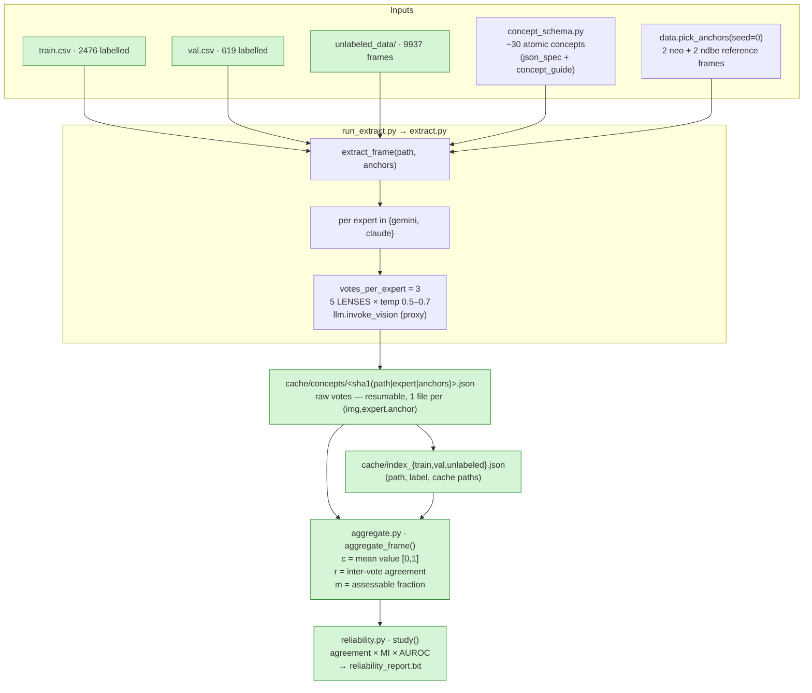
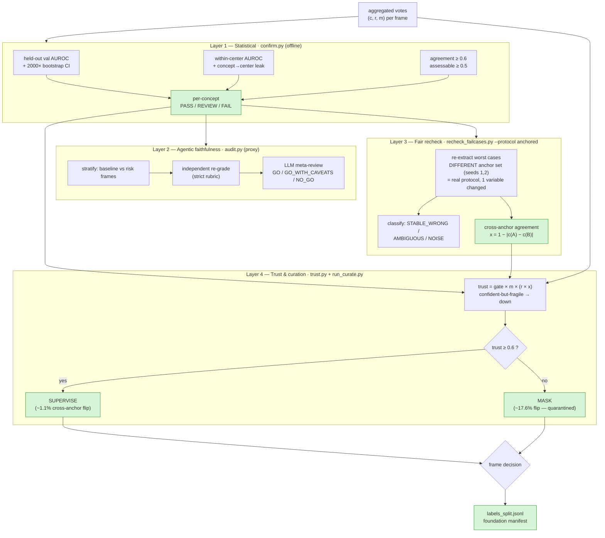
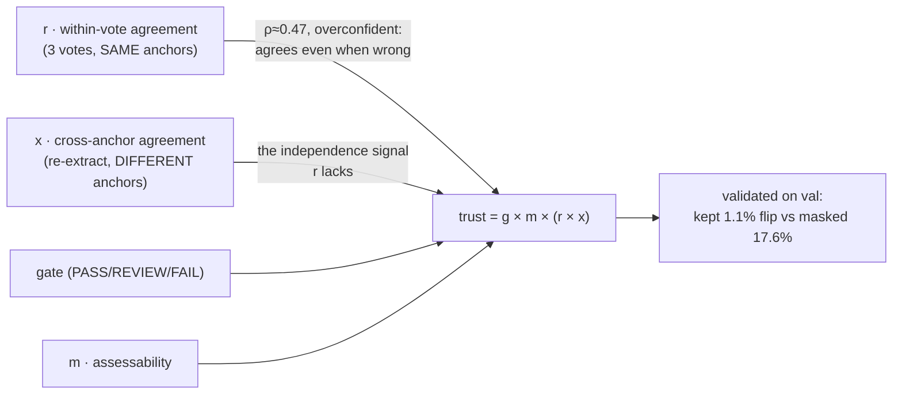
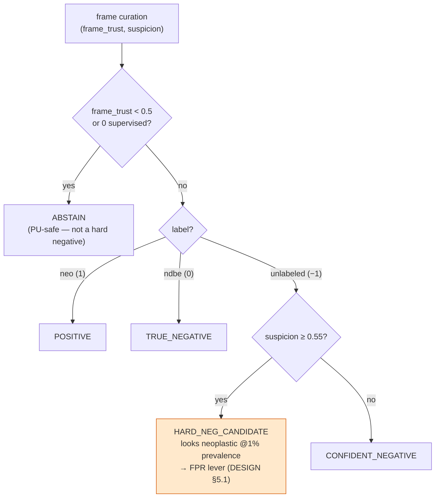

# RACE Phase-1 — Label Generation & Confirmation Pipeline

End-to-end flow from raw frames to a **best-sure** foundation-label manifest, mapped to the code.

---

## 1. Label generation (multi-expert concept extraction)

> **State today:** `gemini` expert complete on all splits (2476 / 619 / 9937, 0 empty caches).
> `claude` expert blocked — cloud key invalid (resumable once `CF_CLOUD_KEY` is set).

---

## 2. Label confirmation & audit (is it usable as foundation supervision?)

---

## 3. Trust signal — why cross-anchor, not just vote-agreement

---

## 4. Per-frame foundation decision

