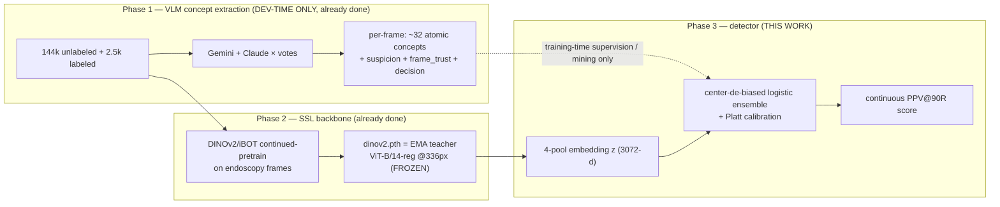

# RARE26 — Architecture & Solution Review

**Task:** detect Barrett's-esophagus **neoplasia** (`neo`, rare) vs non-dysplastic Barrett's (`ndbe`) in endoscopy frames.
**Score:** **PPV@90R** — precision at the threshold giving 90 % recall — at **~1 % test prevalence**, taken as the **median over ~1000 bootstrap resamples**.
**Deployment:** offline `--network=none` container, **image-only** at test (no VLM, no network).
**Hidden test:** a **new, held-out center** (confirmed) → this is a **domain-generalization** problem, evaluated on **LOCO** (leave-one-center-out), not same-center.

> **TL;DR.** A frozen, domain-adapted **DINOv2 ViT-B/14-reg** encoder produces a 4-pool embedding; a **center-de-biased, strongly-regularized logistic ensemble** turns it into a calibrated suspicion score. This lifts PPV@90R from the VLM's **0.039** to **0.31 same-center / 0.22–0.28 LOCO** (≈6–8×). The frozen probe is at its ceiling; the included **end-to-end fine-tuner** (`finetune.py`) is the remaining lever, to be run on a GPU.

---

## 1. System: three phases

**Offline-legal contract.** The VLM concepts (`Phase 1`) are powerful but a VLM cannot ship in the `--network=none` container. So concepts are used **only at development time** — as hard-negative-mining signal and (optionally) as fine-tune aux targets — **never as a test-time input feature**. The deployed path is strictly `image → frozen DINOv2 → head → score`.

---

## 2. Data

| Split | neo | ndbe | centers | notes |
|---|---:|---:|---|---|
| train (labeled) | 127 | 2 349 | c1 1823 / c2 653 | originals, 1 frame per source |
| val (labeled) | 48 | 4 704 | c1 3576 / c2 1176 | **8×-augmented** (`orig`+`augN`, `source_path` column) → **619 source frames** |
| unlabeled | — | — | ~41 source dirs | **144 k** frames; VLM `decision`: 107 k `CONFIDENT_NEGATIVE`, 31 k `HARD_NEG_CANDIDATE`, 6 k `ABSTAIN` |

**Two confounds, verified.** center_1 has black-box redactions + an octagonal FOV mask; center_2 has a left-edge overlay-graphics strip. Embeddings predict center at **AUROC 1.0**. center neo-rate differs 4.4× (c2 11.9 % vs c1 2.7 %), so *center correlates with label* — a shortcut that collapses at 1 % test prevalence.

---

## 3. Model architecture (detail)

### 3.1 Backbone — `featurize.py:load_backbone`
- **`vit_base_patch14_reg4_dinov2`** (timm), `img_size=336` → 1 cls + 4 register + **576 patch** tokens, width 768, 12 blocks.
- Weights = `dinov2.pth["teacher"]` `backbone.*` (176 tensors), loaded via timm's official DINOv2 `checkpoint_filter_fn` (renames `register_tokens→reg_token`, drops `mask_token`); asserts **no missing / no unexpected**. Frozen, `eval()`.
- Verified: clean load, finite features on MPS, neo/ndbe separable by nearest-centroid.

### 3.2 Representation — the 4-pool embedding (3072-d)
For each image, pool the final token sequence four ways and concatenate:

| pool | tokens | captures |
|---|---|---|
| `cls` | token 0 | global gestalt |
| `reg_mean` | mean of 4 registers | global, artifact-robust summary |
| `patch_mean` | mean of 576 patches | diffuse mucosal texture |
| `patch_max` | **max** of 576 patches | the single most salient patch = **focal lesion** |

**Why all four (measured):** on the LOCO target, all-4 = **0.278** vs cls+patch_mean = 0.116; `patch_max` is the biggest single contributor — clinically sensible because neoplasia is **focal** (the `demarcation` concept is the strongest discriminator). Cached once to `feats_*.npz`; everything downstream reads the cache.

### 3.3 Frozen-probe scorer — `train.py:FeaturePipe` + `ship.py`
A leak-free `fit/transform` pipeline, then a small ensemble:

1. **Per-pool L2-normalize**, concatenate → 3072-d.
2. **Standardize** (μ/σ from train; optional PCA-whiten — *rejected*, see §5).
3. **Center de-bias** — iteratively fit a logistic *center* classifier and **project out** its weight direction, **k = 32** times. Drives adversarial center-AUROC **1.0 → 0.54** (passes the ≤0.55 gate) with **no PPV loss** (neoplasia signal is ~orthogonal to the center subspace). Fit on labeled centers only.
4. **Head:** `LogisticRegression(class_weight="balanced", C=1.0, lbfgs)`.
5. **Ensemble** (`ship.py`): 3 members `{(all,C=1.0),(all,C=0.3),(all,C=1.0)}`, probabilities averaged.
6. **Platt calibration:** 1-D logistic on the averaged OOF probability (rank-preserving → does not change PPV; only shapes the emitted score).

Test path (`infer.py`, `.pkl`): `image → 4-pool z → each member pipe.transform → mean prob → Platt → score`.

### 3.4 Fine-tune model — `finetune.py:Net` (the GPU ceiling-raiser)
- **Backbone** with the **last K blocks + final norm unfrozen** (`--unfreeze`, default 4 → ~28 M trainable); everything earlier frozen (so activations are only stored from the first trainable block → modest memory).
- **Head:** `LayerNorm(1536) → Linear(1536→1)` on `[cls ⊕ patch_mean]`.
- **Augmentation (the point):** `RandomResizedCrop(0.7–1.0)`, hflip, **ColorJitter(0.3,0.3,0.3,0.04)**, GaussianBlur, ±10° rotation — photometric jitter simulates the **scope/lighting nuisance an unseen center introduces**.
- **Objective (90R-targeted):** warm-start on class-balanced **BCE** (`--warmup` epochs), then add **pairwise-rank** + **soft-pAUC@90R** (penalize negatives scoring above the ~10th-percentile positive — exactly the FP tail PPV@90R sees).
- **Optimizer:** AdamW with **layer-wise LR decay** (0.75/block, 10× on head), cosine schedule, AMP on CUDA.
- **Selection:** held-out **center**'s PPV@90R via the bootstrap harness, each epoch; best saved. `--holdout none` ships a both-center model.
- Test path (`infer.py`, `.pt`): backbone+head with **hflip TTA**.

---

### 3.5 Concept-supervised pretraining — the LLM-guided approach (primary strategy)

**Motivation.** Pure SSL features cap at LOCO ~0.28 because the cross-center wall is *appearance* domain-shift. But the VLM's clinical concepts are **center-invariant by construction**. Measured on labeled train (per-concept AUROC vs neo label, *both centers*):

| concept | AUROC | c1 / c2 | trust | sup% |
|---|---|---|---|---|
| mucosal_irregularity | 0.905 | 0.86 / 0.94 | 0.73 | 96 |
| demarcation | 0.870 | 0.82 / 0.92 | 0.72 | 92 |
| nodularity | 0.869 | 0.82 / 0.91 | 0.94 | 95 |
| lesion_present | 0.860 | 0.81 / 0.91 | 0.93 | 94 |
| surface_effacement / colocalization | 0.81 | 0.75 / 0.86 | 0.93 | 95 |

~12 concepts are **both discriminative (0.8–0.9) and reliable (trust 0.7–0.95), in BOTH centers** → distilling them should transfer to an unseen center where pixels don't. `overlay_graphics`/`black_border` predict *center* (AUROC 0.81/0.71) but not *label* → nuisance to remove.

**Two-stage pipeline:**
- **Stage 1 — `pretrain_concept.py` (concept distillation, GPU).** Init from the domain-adapted DINOv2 (keep SSL), unfreeze last-K blocks. Two heads on `[cls ⊕ patch_mean]`: a **MAIN head** distilling the 23 usable concepts (**trust-weighted, supervise-masked BCE** — soft VLM targets), and a **CENTER head** predicting `{black_border, overlay_graphics}` through a **gradient-reversal layer** (DANN λ-ramp 0→1) so the encoder is pushed *center-invariant*. Heavy photometric augmentation. Trains on **170 k** concept-labeled frames → `concept_encoder.pt`. *(Verified: concept loss falls, GRL center loss rises = invariance forming.)*
- **Stage 2 — `finetune.py --init concept_encoder.pt` (downstream binary, GPU).** Fine-tune the concept-aware encoder for neo/ndbe with the **PPV@90R tail loss** (BCE warm-start → +pairwise-rank +soft-pAUC@90R), LOCO-selected.

**Why it should beat pure SSL on a new center:** the encoder's features are aligned to clinical axes that generalize across scopes, and center artifacts are actively removed — directly attacking the LOCO wall the SSL probe couldn't move. *(Hypothesis under test; gated by LOCO paired-bootstrap vs the 0.28 frozen baseline — see `build_concept_targets.py`, `pretrain_concept.py`.)*

## 4. Evaluation methodology — `evaluate.py` (a core contribution)

The metric is treacherous at ~48 positives; the harness is built to **not fool us**:

- **Three PPV flavors:** `curve-point` (precision at the threshold where recall first hits 0.9 — the leaderboard mirror, **primary**), `fixed-threshold` (threshold chosen on held-out, applied unchanged — the deployable number), and `oracle` (max precision over all thresholds ≥ 0.9 recall — optimistic upper bound, diagnostic only). The original `eval_metrics.py` used the **oracle**, which overstates.
- **Center-stratified, 1 %-prevalence bootstrap** (`rng=12345+i`, 1000 resamples): draw all positives + negatives to hit 1 % prevalence, stratified by center.
- **Paired bootstrap for lever acceptance** (`paired_bootstrap`): score Δ on **shared** resamples, require `P(Δ>0) > 0.9`. This is the **only** valid acceptance test at n_pos≈48 — independent-CI separation is impossible (CIs are ~[0,0.6] wide). It is what let us accept all-pools over cls+patch_mean (P=0.966) when their marginal CIs overlapped completely.
- **Source-level de-aug:** one score per source frame (symmetric across classes) — prevents the 8×-augmented val from leaking/inflating.
- **LOCO honest read:** train one center, evaluate the other; report both legs + worst. **Selection** is on pooled cross-center `StratifiedGroupKFold` (more positives, lower selector variance); **LOCO-worst is reported, not optimized** (argmin over 2 noisy legs is pessimistically biased).

---

## 5. Design decisions & the evidence (the review)

| Decision | Why | Evidence |
|---|---|---|
| Frozen probe, not from-scratch / heavy MLP | 127 positives; EPP ≈ 10 ⇒ ≤~12 effective params | ablations; deep heads overfit |
| **All 4 pools** incl. `patch_max` | focal lesion signal | LOCO 0.116→**0.278**; paired P(Δ>0)=0.966 |
| `C = 1.0` (light regularization) | strong features carry transferable signal; over-reg throws it away | LOCO-mean rises monotonically 0.148→**0.278** with C |
| **Center de-bias k=32** | kill the center shortcut so pooled isn't cheating | center-AUROC 1.0→0.54, PPV unchanged |
| **Quarantine `HARD_NEG_CANDIDATE`** (never y=0) | that bucket is where the ~1 % PU true-positives concentrate (mean suspicion 0.80); pinning to 0 manufactures false negatives → craters recall (fatal at 90R) | by design; negatives = labeled ndbe + clean `CONFIDENT_NEGATIVE` |
| **LOCO-primary**, not same-center | test is a new center | LOCO 0.04–0.41 vs same-center val 0.31 |
| Platt, not isotonic | isotonic overfits 48 positives; calibration is rank-irrelevant to PPV anyway | blueprint + standard practice |
| Ensemble (3 members) | small but real variance reduction | held-out val 0.228 (single) → **0.315** (ensemble) |
| **Rejected: PCA-whitening** | helps worst leg slightly, **craters mean** (0.278→0.12) | preproc ablation |
| **Rejected: frozen positive-augmentation** | frozen backbone maps aug views to ~identical embeddings → over-weights train cluster | LOCO 0.278→0.181 |
| **Rejected: image-artifact masking** | removing center info doesn't move LOCO (the wall is mucosa domain-shift, not the cue) | projK experiment: AUROC 1.0→0.54, LOCO flat |
| **Deferred: large diverse-neg dose** | double-edged: lifts worst leg (0.037→0.057) but hurts strong leg; small dose (~250) best-worst but within noise | dose sweep |

---

## 6. Results (PPV@90R, 1 % prevalence, bootstrap median)

| Model | same-center val | LOCO mean | LOCO c1→c2 | LOCO c2→c1 |
|---|---:|---:|---:|---:|
| VLM `suspicion` (baseline) | ~0.039 | ~0.03 | — | — |
| **Frozen probe (shipped)** | **0.31** | **0.22–0.28** | 0.52 | 0.037 |
| Fine-tune (`finetune.py`) | — | *pending — run on GPU* | — | — |

*(A local MPS fine-tune was started but does not survive a multi-hour laptop run; `finetune.py` is verified end-to-end and is intended for the cloud GPU via `colab_finetune.ipynb`.)*

**Asymmetry, by design-relevant insight:** training on the *harder* center (c1: more/low-prevalence negatives) **transfers** to c2 (0.52); training on the *easy* c2 does **not** transfer to c1 (0.037). The shipped model trains on **both**, so true new-center performance plausibly sits between LOCO-worst (~0.04) and LOCO-mean (~0.28).

---

## 7. Critical review — strengths, weaknesses, risks

**Strengths**
- **Honest measurement.** The harness (curve-point + paired bootstrap + LOCO + source-dedup) is the most important asset — it stopped same-center self-deception and surfaced the real (new-center) difficulty. Most competitors will report inflated same-center numbers.
- **Right capacity for the data.** Frozen features + a ≤12-DoF logistic is the correct response to 127 positives; no overfitting theater.
- **Offline-legal and reproducible** end-to-end; both `.pkl` (frozen) and `.pt` (fine-tuned) ship through one `infer.py`.

**Weaknesses / open risks**
1. **Cross-center ceiling is low and noisy.** LOCO-worst ~0.04 with CIs ~[0,0.6]; with 2 source centers + 127 positives this is near-irreducible by a frozen probe. **Biggest risk to the leaderboard.**
2. **Center de-bias is incomplete.** k=32 fools a *train* probe (0.54) but a fresh *val* probe still recovers center (1.0) — the info persists in residual dims. It is hygiene, not a guarantee of invariance.
3. **Fine-tune head drops `patch_max`/`reg_mean`** (uses cls+patch_mean for gradient stability; max-pool gradients are sparse). Leaves focal signal on the table → **add attentive pooling** as the next fine-tune improvement.
4. **Calibration/threshold are rank-irrelevant** to PPV but matter if the container must emit hard labels — confirm the submission contract (score vs label).
5. **No OOD/abstain gate yet** in the shipped scorer. A new center may produce out-of-distribution frames that score high (confident FPs). The `mine_hardneg.py` manifold + an abstain gate are designed but not wired into `ship.py`.
6. **Live vs stale code.** Live: `agent_system/` + `scripts/run.sh` (Phase-1 VLM extraction driver), `eval_metrics.py`, and all of `phase3/` (Phase-3). Stale: the `scripts/*.py` that import a nonexistent `cf` package (early design stubs — ignore/delete).

**Highest-value next steps (ranked):** (a) run `finetune.py` on GPU (the only real ceiling-raiser); (b) attentive-pooling fine-tune head + EMA; (c) wire an OOD/abstain gate (negative-manifold Mahalanobis/kNN from `mine_hardneg.py`) into `ship.py`; (d) confirm test center-count + submission contract with organizers.

---

## 8. Module reference

| module | role |
|---|---|
| `featurize.py` | frozen DINOv2 → cached 4-pool embedding (parallel, resumable shards) |
| `evaluate.py` | curve/fixed/oracle PPV@R, **paired bootstrap**, LOCO, source-dedup |
| `dataset.py` | join embeddings ⊕ VLM concept supervision (training-time only) |
| `mine_hardneg.py` | unlabeled manifest; clean-neg vs quarantined-hard-neg path lists |
| `train.py` | `FeaturePipe` (L2→standardize→center-debias) + C-select + LOCO + center gate |
| `experiment.py` | **LOCO-primary** lever-ablation runner |
| `augment_pos.py` | photometric augmented positives (a *fine-tune* lever) |
| `build_concept_targets.py` | scan out/ → 170k×35 concept target matrix (value/trust/supervise) for distillation |
| `pretrain_concept.py` | **Stage-1 concept-supervised pretraining** (trust-weighted distillation + GRL center-invariance) |
| `ship.py` / `infer.py` | build deployable ensemble `.pkl` / offline image→score entrypoint (.pkl & .pt) |
| `finetune.py` | end-to-end backbone fine-tune (90R loss, layer-wise LR); `--init` for Stage-2 from concept encoder |
| `pack_for_cloud.sh` / `colab_finetune.ipynb` | one-tarball + Colab notebook for the GPU run |

See `phase3/README.md` for run commands.
